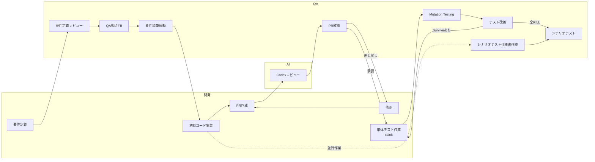

```mermaid
flowchart LR

subgraph 開発
    D1[要件定義]
    D2[初期コード実装]
    D3[PR作成]
    D4[修正]
    D5[単体テスト作成<br/>xUnit]
end

subgraph AI
    A1[Codexレビュー]
end

subgraph QA
    Q1[要件定義レビュー]
    Q2[QA観点FB]
    Q3[要件加筆依頼]
    Q4[PR確認]
    Q5[Mutation Testing]
    Q6[テスト改善]
    Q7[シナリオテスト仕様書作成]
    Q8[シナリオテスト]
end

D1 --> Q1
Q1 --> Q2
Q2 --> Q3
Q3 --> D2
D2 --> D3
D3 --> A1
A1 --> Q4
Q4 -->|差し戻し| D4
D4 --> D3
Q4 -->|承認| D5
D5 --> Q5
Q5 --> Q6
Q6 -->|Surviveあり| D5
Q6 -->|全KILL| Q8

D2 -.並行作業.-> Q7
Q7 --> Q8
```
