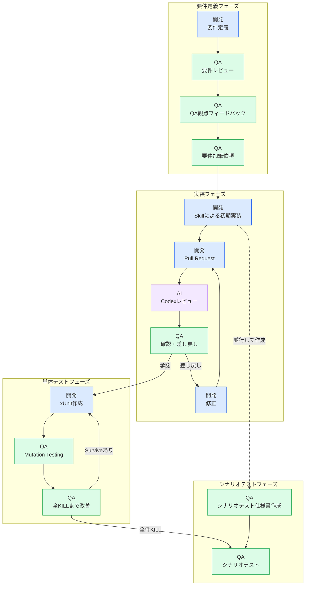

```mermaid
flowchart TB

    subgraph 要件定義フェーズ
        D1[開発<br>要件定義]
        Q1[QA<br>要件レビュー]
        Q2[QA<br>QA観点フィードバック]
        Q3[QA<br>要件加筆依頼]

        D1 --> Q1 --> Q2 --> Q3
    end

    subgraph 実装フェーズ
        D2[開発<br>Skillによる初期実装]
        D3[開発<br>Pull Request]
        A1[AI<br>Codexレビュー]
        Q4[QA<br>確認・差し戻し]
        D4[開発<br>修正]

        D2 --> D3 --> A1 --> Q4
        Q4 -->|差し戻し| D4
        D4 --> D3
    end

    subgraph 単体テストフェーズ
        D5[開発<br>xUnit作成]
        Q5[QA<br>Mutation Testing]
        Q6[QA<br>全KILLまで改善]

        D5 --> Q5 --> Q6
        Q6 -->|Surviveあり| D5
    end

    subgraph シナリオテストフェーズ
        Q7[QA<br>シナリオテスト仕様書作成]
        Q8[QA<br>シナリオテスト]
    end

    Q3 --> D2
    Q4 -->|承認| D5
    Q6 -->|全件KILL| Q8

    D2 -.並行して作成.-> Q7
    Q7 --> Q8

    classDef dev fill:#dbeafe,stroke:#2563eb
    classDef qa fill:#dcfce7,stroke:#16a34a
    classDef ai fill:#f3e8ff,stroke:#9333ea

    class D1,D2,D3,D4,D5 dev
    class Q1,Q2,Q3,Q4,Q5,Q6,Q7,Q8 qa
    class A1 ai
```
