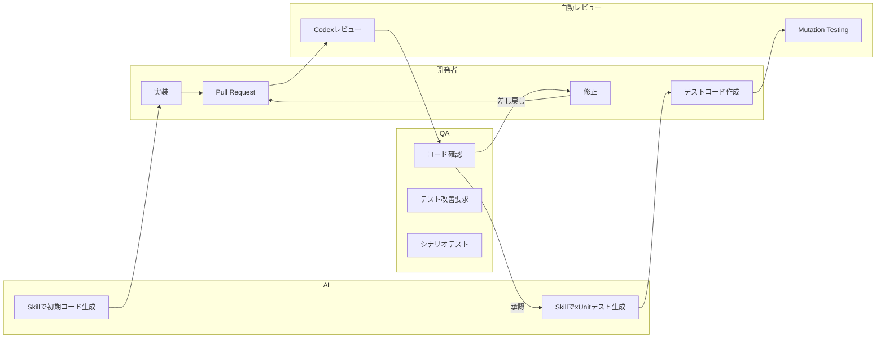

```mermaid
flowchart LR

subgraph AI
    A1[Skillで初期コード生成]
    A2[SkillでxUnitテスト生成]
end

subgraph 開発者
    D1[実装]
    D2[Pull Request]
    D3[修正]
    D4[テストコード作成]
end

subgraph 自動レビュー
    C1[Codexレビュー]
    C2[Mutation Testing]
end

subgraph QA
    Q1[コード確認]
    Q2[テスト改善要求]
    Q3[シナリオテスト]
end

A1 --> D1
D1 --> D2
D2 --> C1
C1 --> Q1

Q1 -->|差し戻し| D3
D3 --> D2

Q1 -->|承認| A2
A2 --> D4
D4 --> C2
```

C2 -->|Surviveあり| Q2
Q2 --> D4

C2 -->|全件KILL| Q3
Q3 --> End[リリース判定]
